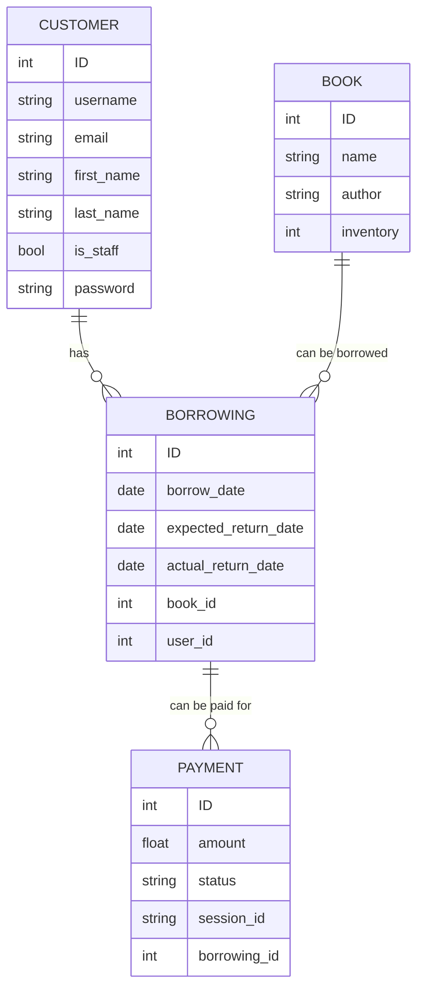

# 📚 Library Service

## Project Description

**Library Service** is a web application that enables users to manage library borrowings, process payments, and receive notifications via Telegram. Administrators have the ability to manage books, users, and monitor all borrowings.

## 🛠 Technologies Used

- **Python 3.10**
- **Django 5.0.7** - Main web framework
- **Django REST Framework** - For creating RESTful APIs
- **Stripe API** - For payment processing
- **SQLite** - Default database (can be changed)
- **Telegram Bot API** - For Telegram notifications
- **Gunicorn** - WSGI server for running Django in production
- **Nginx** - Reverse proxy server

## 🗃 Database Schema

### Main Tables:

- **Customer**: User information (ID, username, email, first_name, last_name, is_staff, password)
- **Book**: Book information (ID, name, author, inventory)
- **Borrowing**: Borrowing information (ID, user, book, borrow_date, expected_return_date, actual_return_date)
- **Payment**: Payment information (ID, borrowing, amount, status, session_id)



## 🚀 Installation Instructions

### Local Installation

1. **Clone the repository:**
   ```bash
   git clone https://github.com/skeletronys/Library-Service.git
   cd library-service

2. **Create and activate a virtual environment:**
    ```bash
    python -m venv .venv
    source .venv/bin/activate  # Unix/MacOS
    .venv\Scripts\activate  # Windows

3. **Install dependencies:**
    ```bash
    pip install -r requirements.txt

4. **Set up environment variables: Create a .env file in the project root directory with the following variables:**
    ```bash
    SECRET_KEY=your_secret_key
    TELEGRAM_TOKEN=your_telegram_token
    TELEGRAM_CHAT_ID=your_chat_id
    STRIPE_API_KEY=your_stripe_api_key

5. **Run database migrations:**
    ```bash
    python manage.py migrate

6. **Start the server:**
    ```bash
    python manage.py runserver

7. **Create an admin user:**
    ```bash
    python manage.py createsuperuser

8. **Visit the site: Open your browser and go to:**
    ```bash
    http://localhost:8000

9. **Run celery tasks and redis**
   ```bash
   redis-server.exe
   celery -A Library_Service worker -l info -P gevent
   celery -A Library_Service beat -l info

